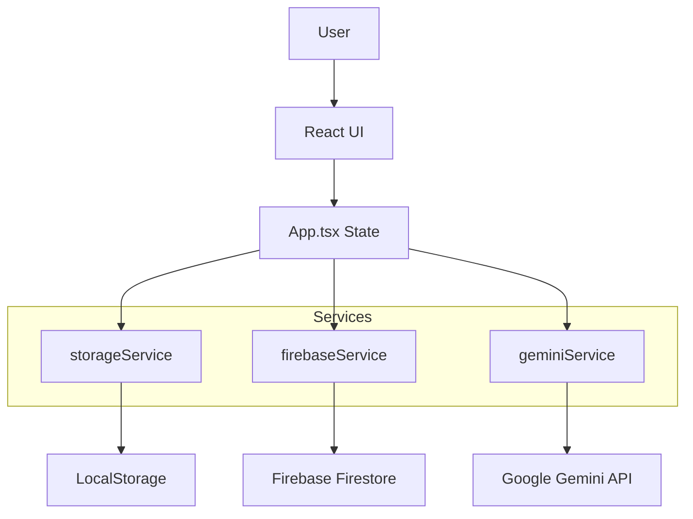

# System Patterns

## Architecture
The application follows a standard Single Page Application (SPA) architecture using React. It relies heavily on client-side state and browser storage.

## Key Technical Decisions

### 1. Cloud-First Data Strategy (Updated)
- **Decision**: Primary data source is `Firestore` (Realtime).
- **Reason**: Ensures synchronization across all devices. LocalStorage is now used as a cache/backup.
- **Pattern**: `App.tsx` uses `subscribeToUserData` to listen for cloud changes and updates React state instantly.

### 2. Auth Wall
- **Decision**: App content is hidden until user logs in.
- **Reason**: Protects data on public URLs (GitHub Pages) and ensures user sees *their* data, not empty local state.

### 2. Centralized State (App.tsx)
- **Decision**: Managing global state (`tools`, `workflows`, `user`, `settings`) in the root `App` component.
- **Reason**: Simplifies prop drilling for a medium-sized app.
- **Trade-off**: `App.tsx` is large and handles many concerns (routing, auth, sync). This is a known refactoring candidate.

### 3. Realtime Cloud Sync
- **Decision**: Changes are pushed immediately to Firestore; updates are received via streams.
- **Reason**: User requirement for seamless multi-device experience.
- **Implementation**: `saveUserDataToCloud` is called on every write action. `onSnapshot` handles read updates.

### 4. Security Layer
- **Decision**: Application-level PIN lock.
- **Implementation**: A simple boolean flag `isLocked` in `App.tsx` conditionally renders the `LockScreen` component before the main app interface.

## Component Structure
- **Pages**: `Dashboard`, `ToolLibrary`, `SubscriptionManager`, `WorkflowBuilder`. Handle specific feature views.
- **Components**: `Sidebar` (Navigation), `ToolForm` (Modal for editing), `ToolCard`.
- **Services**: Encapsulate external API logic.

## Data Models (from types.ts)
- **Tool**: Core entity. Contains pricing, status, links.
- **Workflow**: Composed of Steps.
- **WorkflowStep**: Links to Tools with specific `WorkflowToolConfig` (quantity/usage).
